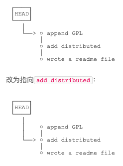

[toc]

# git 命令

## git 基本安装配置

1. 安装 略
2. 配置用户名与 email
   ```
   git config --global user.name "lishen"
   git config --global user.email "lishen_ls@outlook.com"
   ```

## 创建 git 版本库以及简单使用

1. 初始化 git 版本库
   ```
   git init
   ```
2. 添加文件
   ```
   git add xxx.txt
   ```
   > 可一次性添加多个文件`git add file1 file2 file3`
3. 提交文件到仓库
   ```
   git commit -m "test"
   ```
   > -m 是本次提交的说明
4. 查看暂存区和工作区状态
   ```
   git status
   ```

## 版本回退

1. 查看提交日志
   ```
   git log
   ```
   > 使用`--pretty=online`简化 log 输出
2. 版本回退
   ```
   git reset --hard HEAD^
   ```
   > --hard ?  
   > HEAD 表示当前版本，^表示上一个版本，多个版本前可以简写为~xx
   ```
   git reset --hard <git版本号>
   ```
   > 可以回到指定的版本  
   > 版本号可以不写全，只要前几位是唯一的  
   > git 版本回退的本质是修改 HEAD 指向，所以版本的修改速度很快  
   >
