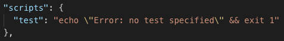

[TOC]

# npm

## npm 常用指令

- init 初始化项目，生成 package.json

  - -y 所有提问阶段全部 yes，-f 反之

- set 设置环境变量
  > 例如
  >
  > ```
  > npm set init-author-name 'xxx'
  > ```
  >
  > 该命令设置了 npm init 中 author-name 的默认值
- config get/set 获取/设置 npm 的配置
  > npm config get resgistry  
  > 获取 npm 的源
- info 获取模块的详细信息

  > 

- search 搜索 npm 仓库，可使用正则表达式
- list 以树形结构列出当前目录下安装的模块以及其依赖

  > -global/-g 全局模块

- install 安装模块
  - -global/-g 全局安装
  - --force 强制安装
  - npm install xxx@1.0.0 指定版本安装，@next 安装还未发行的新版本
  - --save/-S 将模块名添加到 dependencies
  - --save-exect 在 dependencies 中添加详细版本
  - --save-dev/-D 将模块名添加到 devDependencies
  - install 默认安装所有模块，--production 参数只安装 dependencies 模块,即只安装生产环境的模块

    ```
    npm install --production
    //or
    NODE_ENV=production npm install
    ```

  - install 支持 Github 链接

    ```
    npm install git://github.com/package/path.git@1.0.0
    ```
- update/uninstall 更新/卸载模块
  > 多数参数同 install  
  > update 不更新深层依赖模块，可用以下命令更新深层模块  
  > `npm --depth xxxx update`
- run 执行脚本
  > package.json 文件中的 scripts 字段用于指定命令对应的脚本  
  >   
  > start 和 test 属于特殊命令，执行时可以不加 run  
  > -s 不输出 npm 命令头，只输出脚本的输出
- link/unlink 生成模块链接
  > 在需要被使用的模块的目录下使用 link 生成全局链接，在使用该模块的目录下使用 link xxx 将链接引入本地模块  
  > 项目内使用 unlink xxx 取消对模块的链接
- adduser

  > 用于注册 npmjs.com 的账户

- publish 发布模块
  > 提交前需要注册 npmjs 账户
  > 使用 npm login 登录账户后即可发布模块
  > 默认发布标签为 latest，使用--tag 参数可设置为 beta  
  > `npm publish --tag beta`  
  > 付费用户可发布私有模块  
  > 私有模块在初始化时使用以下命令  
  > `npm init --scope=<xxxx>`
