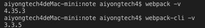

[TOC]

# webpack 配置

> 以下使用的插件和 loader 需要手动 npm install  
> [webpack3.X](http://jspang.com/posts/2017/09/16/webpack3.html)  
> 使用的 webpack 版本为 4.53.0

## webpack 的安装

```
sudo npm install -g webpack
sudo npm install -g webpack-cli //3.X不需要
sudo npm install -g webpack-dev-server
```

> 查看版本
>
> ```
> webpack -v
> webpack-cli -v
> ```
>
> 

```
webpack {enrty file} {output}
```

> 未配置 webpack.config.js 的出入口文件时启动 webpack 打包

## 打包出入口配置

```javascript
//基本结构
module.exports = {
  entry: {},
  output: {},
  //模块
  module: {},
  //插件
  plugins: [],
  devServer: {}
};
```

1. entry 入口文件

   ```javascript
   entry: {
     entry: './src/entry.js'
     //这里的entry变量名随便写
   }
   ```

2. output 出口文件
   ```javascript
   output: {
     //打包输出路径
     path: path.resolve(__dirname,'xxx'),
     //输出的文件名
     filename: 'bundle.js'
   }
   ```
3. 多入口多出口配置
   ```javascript
   entry: {
     entry: "./src/entry.js",
     entry2: "./src/entry2.js"
   },
   output: {
     path: path.resolve(__dirname, "dist"),
     filename: "[name].js"
     //[name]表示输出的文件名依据入口文件来命名
   }
   ```

## webpack-dev-server 热更新

1. webpack.config.js
   ```javascript
   devServer: {
     //打包输出目录
     contentBase: path.resolve(__dirname, "dist"),
     host: "localhost",
     //启用压缩
     compress: true,
     //监听端口
     port: 8000
   }
   ```
2. package.json
   ```json
   "scripts": {
     "server": "webpack-dev-server",
     "build": "webpack"
   }
   ```
   > 使用`npm run server`来启动 webpack-dev-server 热更新

## 模块配置

1. Loaders  
   通过使用不同的 Loader 可以使得 webpack 对不同的文件来进行针对处理
2. 配置示例

- 使用 loader 需要修改 webpack.config.js 的 rules 字段，筛选出不同的文件类型，采用不同给的 loader
- style-looder 和 css-loader
  > 三种写法
  ```javascript
  rules: [
    {
      test: /\.css$/,
      use: ["style-loader", "css-loader"]
    }
  ];
  ```
  ```javascript
  rules: [
    {
      test: /\.css$/,
      loader: ["style-loader", "css-loader"]
    }
  ];
  ```
  ```javascript
  rules: [
    {
      test: /\.css$/,
      use: [
        {
          loader: "style-loader"
        },
        {
          loader: "css-loader"
        }
      ]
    }
  ];
  ```
  >

## 插件配置

- 使用插件需要修改 webpack.config.js 的 plugins 字段
- 使用插件前需要 require 引入插件
- js 代码压缩插件 uglifyjs-webpack-plugin

  ```javascript
  //uglifyjs-webpack-plugin引用后命名为uglify
  plugins: [new uglify()];
  ```

- html 打包插件 html-webpack-plugin

  ```javascript
  //html-webpack-plugin引用后命名为htmlPlugin
  plugins: [
    new htmlPlugin({
      minify: {
        // 压缩html
        removeAttributeQuotes: true
      },
      filename: "index.html", //打包后生成的文件名
      hash: true, // 为js文件生成一个hash值，可以用于防止JS缓存
      template: "./src/index.html" // 被打包的html文件的路径
    })
  ];
  ```

## 常见配置

### 图片处理

1. CSS 中的图片:file-loader 和 url-loader

   > file-loader:解析项目中的 url，根据配置将图片放置在相应路径，生成对应的引用路径
   >
   > url-loader:将多个图片数据打包到一个文件中，降低 http 请求数量，可设置 limit 参数来控制图片被打包或由 file-loader 引入

   ```javascript
   rules:[
     test:/\.(png|jpg|gif)/,
     use:[{
       loader:'url-loader',
       options:{
         limit:500000
         //单位为字节
         outputPath:'images/'
         //图片的输出目录
       }
     }]
   ]
   ```

   > url-loader 封装了 file-loader，不依赖于 file-loader，故不需要引入 file-loader

2. CSS 分离:extract-text-webpack-plugin

   > webpack4.0 需要安装 extract-text-webpack-plugin@next  
   > 首先在 plugins 中实例化 extract 插件，使用 extract 插件的 extract()方法对 style-loader 和 css-loader 进行处理
   >
   > ```javascript
   > {
   >   test: /\.css$/,
   >   use: extractTextPlugin.extract({
   >     fallback: "style-loader",
   >     use: "css-loader",
   >     publicPath: "../"
   >     //publicPath生成css文件中正确的url
   >   })
   > }
   > ```

3. HTML 中的图片:html-withimg-loader
   > 在 url-loader 的 options 中添加 outputPath 设置图片输出的目录
   ```javascript
   {
     test: /\.(htm|html)$/i,
     use: ['html-withimg-loader']
   }
   ```

### CSS 处理

1. Less 打包与分离
   ```
   npm install --save-dev less less-loader
   ```
   ```javascript
   //less-loader打包配置
   {
     test: /\.less$/,
     use: [
       {
         loader: "style-loader"
       },
       {
         loader: "css-loader",
       },
       {
         loader: "less-loader"
       }
     ]
   }
   ```
   > Less 分离同样使用 extract-text-webpack-plugin
   >
   > ```javascript
   > {
   >   test: /\.less$/,
   >   use: extractTextPlugin.extract({
   >     use: [
   >       { loader: "css-loader" },
   >       { loader: "less-loader" }
   >     ],
   >   fallback: "style-loader"
   >   })
   > }
   > ```
2. Sass 打包与分离  
   使用方式与 Less 一致  
   安装 node-sass 和 sass-loader
   ```
   npm install --save-dev node-sass sass-loader
   ```
3. CSS3 属性前缀自动生成

- 安装 postcss-loader 和 autoprefixer
  ```
  npm install --save-dev postcss-loader autoprefixer
  ```
- 在根目录创建 postcss.config.js
  ```javascript
  module.exports = {
    plugins: [require("autoprefixer")]
  };
  ```
- webpack.config.js
  ```javascript
  {
    test: /\.css$/,
    use: extractTextPlugin.extract(
      {
        fallback: "style-loader",
        use:[
          { loader: "css-loader", options: { importLoaders: 1 } },
          //importLoaders指的是css-loader之后使用几个加载器处理css文件，默认为0
          { loader: "postcss-loader" }
        ],
        publicPath: "../"
      }
    )
  }
  ```

4. 去掉未使用的 CSS

- 安装 PurifyCSS-webpack 和 purify-css
  ```
  npm install -D purifycss-webpack purify-css
  ```
- 配置 plugins
  ```javascript
  new PurifyCSSPlugin({
    paths: glob.sync(path.join(__dirname, "src/*.html"))
    //glob自行引入
    //根据paths来查找哪些css被使用过
  });
  ```

### Babel

- 安装 Babel
  ```
  npm install -D babel-core babel-loader babel-preset-es2015 babel-preset-react
  ```
- webpack.config.js
  ```javascript
  {
    test: /\.(js|jsx)/,
    use: {
      loader: "babel-loader",
      options: {
        preset: ["es2015", "react"]
      }
    },
    exclude: /node_modules/ //排除编译
  }
  ```
- .babelrc

  > babel 的 options 可以从 webpack.config.js 中分离，写到项目根目录的.babelrc 文件中

  .babelrc

  ```javascript
  {
    "presets":["react","es2015"]
  }
  ```

- ENV
  ```
  npm install -D babel-preset-env
  ```
  .babelrc
  ```javascript
  {
    "presets":["react","env"]
  }
  ```

### 打包后调试

1. webpack 可以通过配置 devtool 来自动生成 source maps 文件，map 文件可以将编译文件和源文件对应
2. devtool 有四种选项

- source-map:在一个单独文件中产生一个完整且功能完全的文件。这个文件具有最好的 source map,但是降低了打包速度
- cheap-module-source-map:在一个单独的文件中产生一个不带列映射的 map，不带列映射提高了打包速度，只能使得开发者工具对应到行，无法具体到列（符号）
- eval-source-map:使用 eval 打包源文件，在同一个文件生成完整的 source map，输出的 js 文件性能和安全可能受影响，仅适合用于开发环境
- cheap-module-eval-source-map:最快的产生 source map 的方法，source map 与打包后的 js 文件同行显示，没有列映射，和 eval-source-map 有相似缺点

3. 简单配置
   ```javascript
   devtool: "eval-source-map";
   ```

## 错误

1. Error: Cannot find module 'uglifyjs-webpack-plugin'
   ```
   npm install -D uglifyjs-webpack-plugin
   ```
2. Error: Cannot find module 'webpack/lib/RequestShortener'
   ```
   npm install -D webpack webpack-cli
   ```
   > 即使全局安装了 webpack 以及 webpack-cli 仍然需要本地安装
3. webpack4.0 中使用 extract-text-webpack-plugin
   ```
   npm install -D extract-text-webpack-plugin@next
   ```
